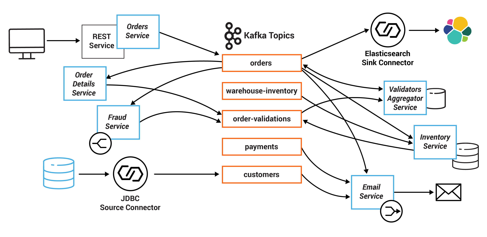
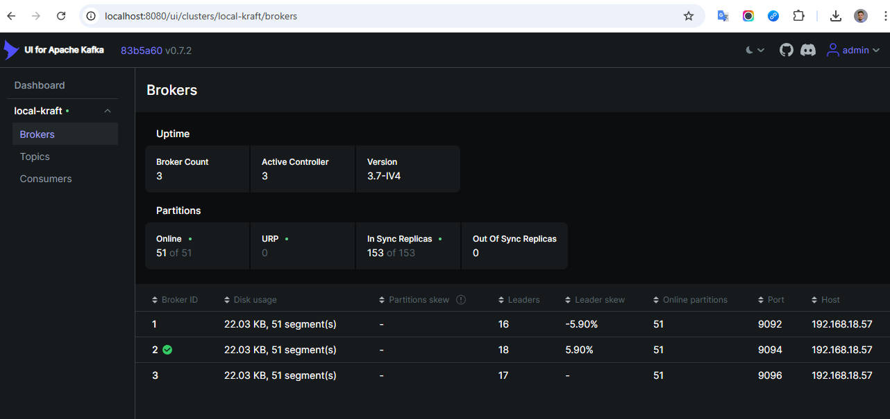
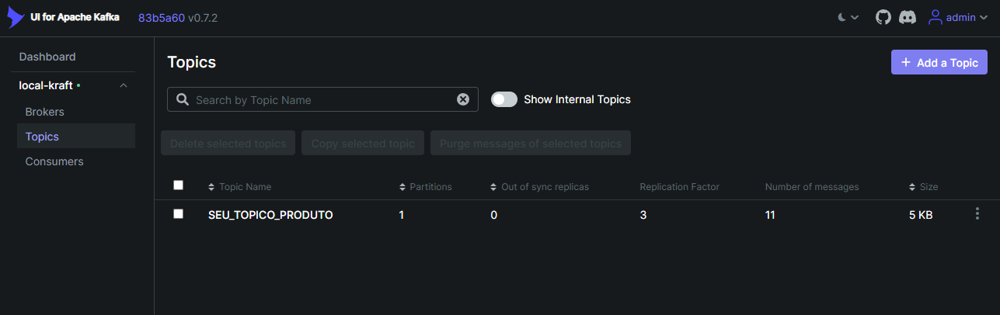
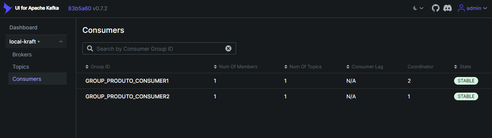

# O que é o Kafka

Apache Kafka é uma plataforma de streaming de eventos distribuída e de código aberto, **projetada para lidar com feeds de dados em tempo real de maneira eficiente**. Kafka é amplamente utilizado para construir pipelines de dados em tempo real e aplicativos de streaming de dados.

<aside>
💡 **Curiosidade**: ela desenvolvida pela LinkedIn e posteriormente doada para a Apache Software Foundation

</aside>

### Principais Componentes do Kafka:

1. **Producer (Produtor):**
    - Envia registros (mensagens) para os tópicos do Kafka.
2. **Consumer (Consumidor):**
    - Lê e processa os registros de um ou mais tópicos.
3. **Topics (Tópicos):**
    - Categorias ou canais onde os registros são armazenados. Cada tópico pode ser particionado.
4. **Partitions (Partições):**
    - Subdivisões de um tópico que permitem a distribuição e paralelização dos dados. Cada partição é uma sequência ordenada e imutável de registros.
5. **Broker:**
    - Um servidor Kafka que armazena os dados e os serve aos consumidores.
6. **Cluster:**
    - Conjunto de brokers que trabalham juntos para fornecer alta disponibilidade e escalabilidade.
  

### Vantagens do Kafka

- O Kafka permite que produtores e consumidores de dados sejam desacoplados.
    - *Ou seja, os microserviços podem produzir e consumir mensagens sem precisar conhecer diretamente uns aos outros. Isso facilita a adição, remoção ou atualização de microserviços sem afetar o restante do sistema.*
- Kafka pode armazenar mensagens por um período configurável
    - *Permitindo que novos consumidores "reproduzam" eventos antigos para reconstruir o estado atual do sistema.*
- Os dados são persistidos em disco, permitindo recuperação em caso de falhas.
  

## Kafka UI

## Parâmetros

| Parâmetro                        | Valor                         | Descrição |
|---------------------------------|-------------------------------|-----------|
| compression.type (producer)      |                               | Tipo de compressão usada pelo produtor (`none`, `gzip`, `snappy`, `lz4`, `zstd`) |
| leader.replication.throttled.replicas |                       | Réplicas do líder com limite de taxa de replicação (throttle) |
| remote.storage.enable            | false                         | Habilita armazenamento remoto (Tiered Storage) |
| message.downconversion.enable    | true                          | Permite leitura de mensagens por clientes mais antigos |
| min.insync.replicas              | 2                             | Número mínimo de réplicas sincronizadas para aceitar gravação com `acks=all` |
| segment.jitter.ms                | 0                             | Aleatoriedade na rotação de segmentos para evitar picos simultâneos |
| local.retention.ms               | -2                            | Retenção local para Tiered Storage |
| cleanup.policy                   | delete                        | Política de limpeza (`delete`, `compact` ou ambos) |
| flush.ms                          | 9223372036854775807          | Intervalo máximo de flush em ms |
| follower.replication.throttled.replicas |                       | Réplicas seguidores com limitação de taxa |
| segment.bytes                     | 1073741824                    | Tamanho máximo de cada segmento de log (1 GB) |
| retention.ms                      | 604800000                     | Tempo de retenção de mensagens (7 dias) |
| flush.messages                    | 9223372036854775807           | Número máximo de mensagens antes de flush |
| message.format.version            | 3.0-IV1                       | Versão do formato de mensagens do tópico |
| max.compaction.lag.ms             | 9223372036854775807           | Máximo tempo de espera antes de compaction |
| file.delete.delay.ms              | 60000                         | Delay antes de deletar segmentos expirados (1 min) |
| max.message.bytes                 | 1048588                       | Tamanho máximo de uma mensagem (~1 MB) |
| min.compaction.lag.ms             | 0                             | Mínimo tempo antes de uma mensagem ser compactada |
| message.timestamp.type            | CreateTime                    | Tipo de timestamp (`CreateTime` ou `LogAppendTime`) |
| local.retention.bytes             | -2                            | Máximo tamanho de dados locais antes de mover para remoto |
| preallocate                        | false                         | Pré-alocação de espaço em disco para segmentos |
| min.cleanable.dirty.ratio         | 0.5                           | Proporção mínima de dados obsoletos para compaction |
| index.interval.bytes              | 4096                          | Intervalo de indexação dentro do segmento |
| unclean.leader.election.enable    | false                         | Permite eleição de líder não sincronizado (`false` evita perda de dados) |
| retention.bytes                    | -1                            | Tamanho máximo do log antes de deletar mensagens (`-1` = sem limite) |
